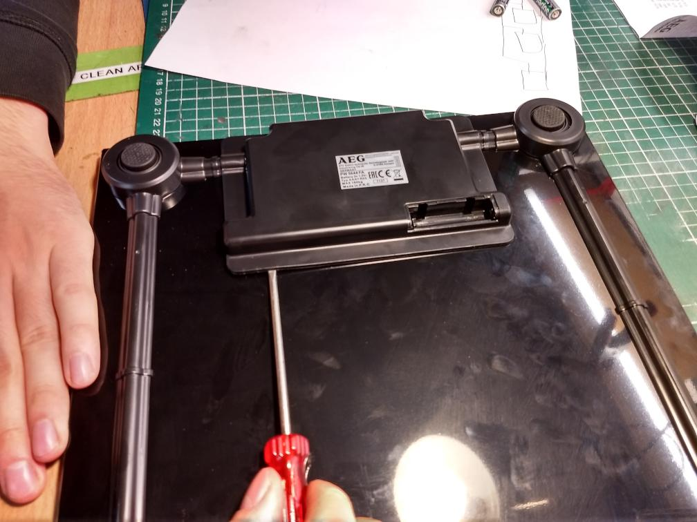
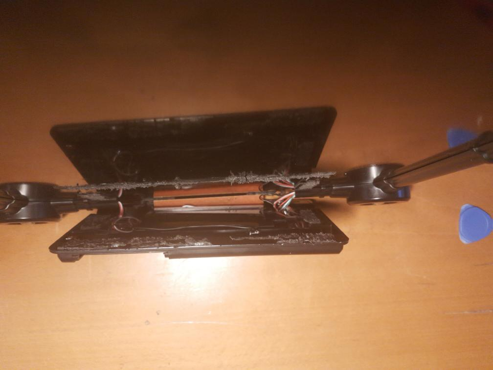
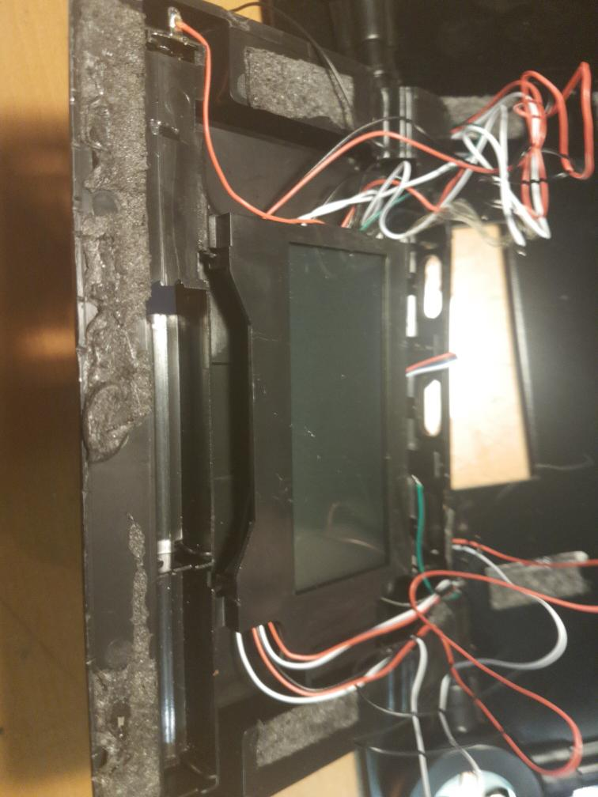
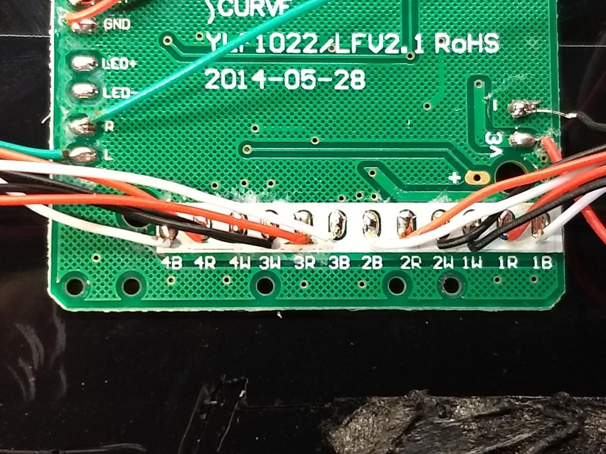
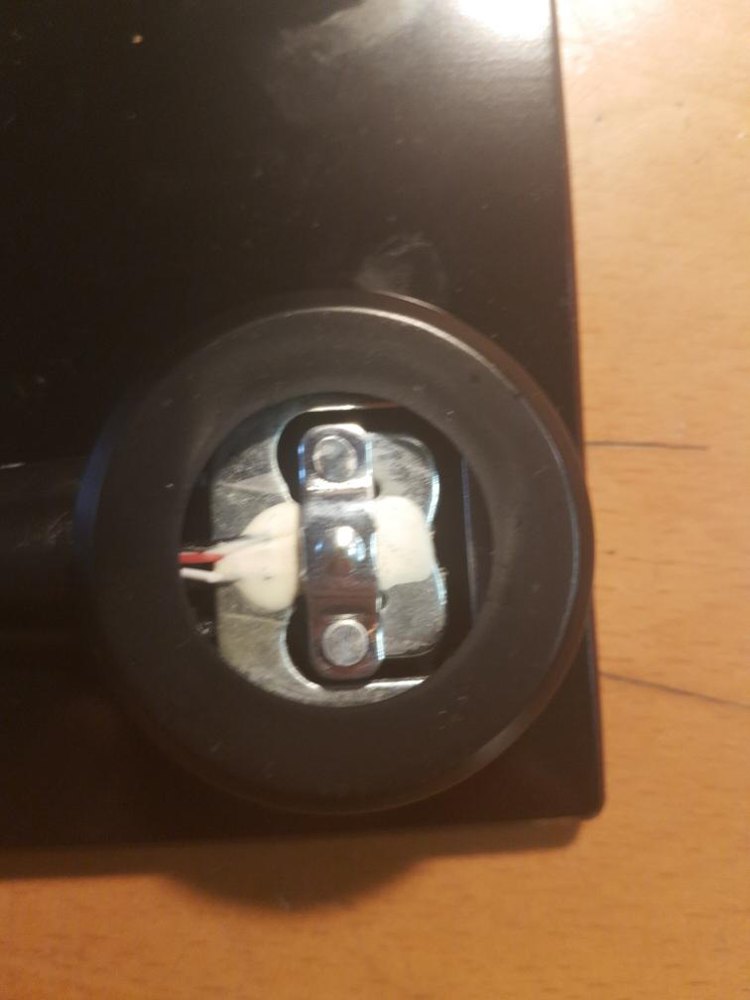
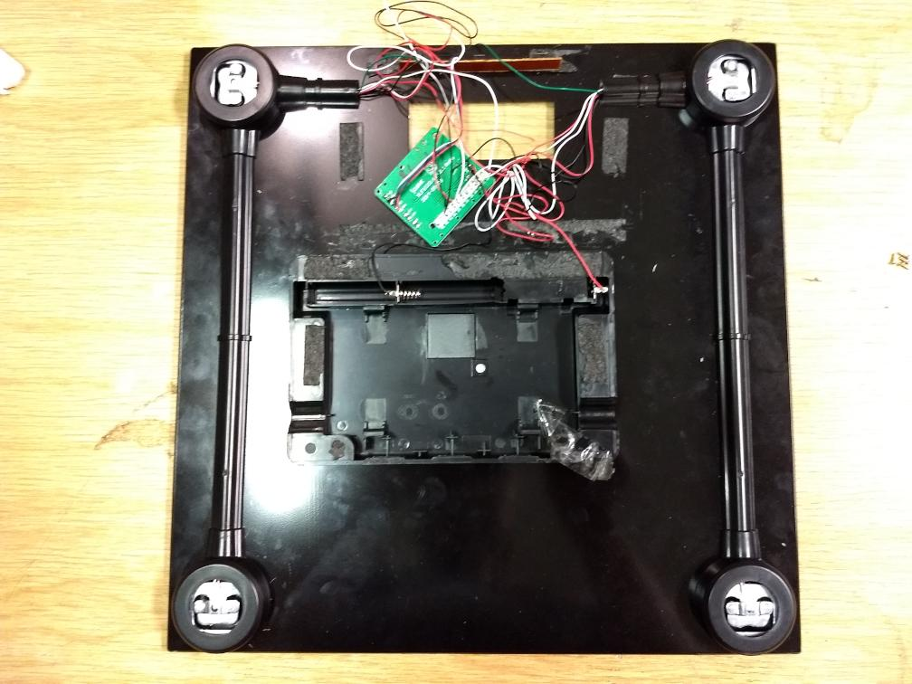
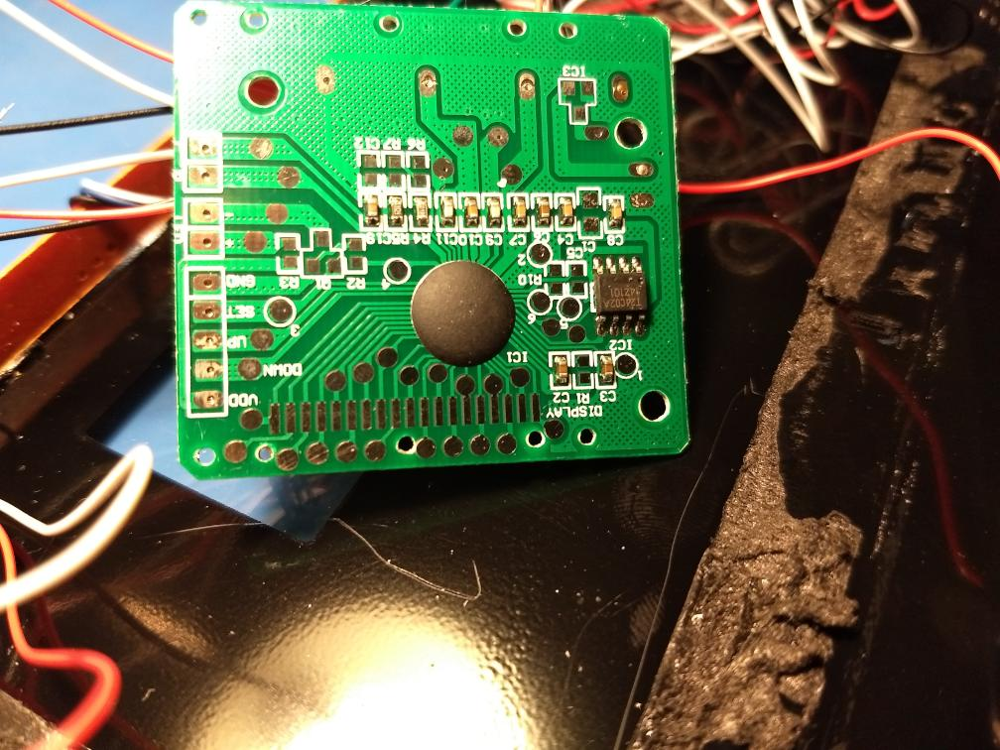
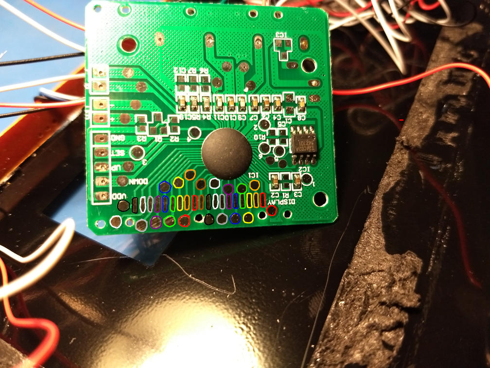
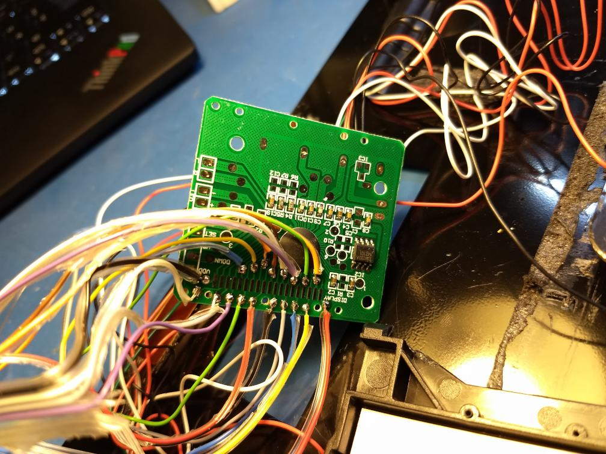

About this document:

This is my draft article for my blog[1]

----

coon[0] and i met on the weekend on 15 th and 16 th for a small hackend (you get it? Hack and weekend)

Some weeks ago we met and discussed some stuff. During that conversation a idea arvided. What if we could send the data of a scale to a server?

In the last days, I play around a lot with graphan and graphite. So would *love* to get some of my metrics into this. 

In store you can get very cheap digital scales. There are not quite precise, but well for measuring humans. It would be awesome o get
the data, displayed on the LCD somewhere else. This way you could automated the process, instead of always writing it down by hand.
Besides, it eliminates me as an error factor. 

Coon's idea is simple yet elegant. We open up such a digital scale and just add some wires to the LCD display and catch the data to a 
ESP. So it was decided. We will a have get tougher and hack some scales. 

## Getting a Scale 

I got a new scale 

### Feature

Besides of just measuring your weight, the modern scales own another unique feature nowadays. They can tell apart the amount of fat, water and substances is composed of. The "Bioelectrical impedance analysis" method is used for this. 

On the surfrace of the scale are two small metal plates. This plates are put under power (0.8 mA) DC with a 50 Hz. Afterwards, the scales measures the values and can tell based on the values how much fat you have. 

This method is quite error prune, represents however a very interning set of data you might would not get to otherwise.
 

## dismantle the scale

The scale was quite 'sticky'. It is impressive how cheap such devises is assembled.

You can just 'remove' the entry plastic block that holds the electronics. Once the block is removed from the bottom side of the glass a the LCD block is unveiled.

The LCD block is embedded into small plastic frame. With a screwdriver you can push the block out of the appliances. This will unveiled the PCB  controller of the scale, that does all the magic. The LCD is placed on the top of the PCD, so we only see the back of the PCB.

The back however holds a set of important connection like VCC, GND and the connection to the gauge connections.

This connections are quite interesting, there are three wires to each pedal of the scale. In here, some magic is happening.

 We continue to disassembled the devise where the PCB is located in. It unveiled the front side of the PCB, where the LCD is located.
This is where we want to be. 

 

## Attaching to the LCD

As we can see in the picture above, there are something like 'testpads' located on the PCB. We think that there are placed during the development process to attach to the LCD connector to test and develop the connections. This pads might be left over there because the engineers were afraid to to change the schema. 

For us it's perfect. We can solder some wires onto the PCD to get the data that are send to the LCD. For this Coon used the Gimp to mark some color coded pads and use this as sample. Next is to wire the PCD according to the color code.

 
 

 

## The end? 

So what is the state of this? 

We have to figure out how the LCD is connected to. WE played around a lot with the devices and broke some the scales. Our research showed
some promises looking documentation that will help us. We will just need another get tougher and continues on understanding the Hardware.

[0]https://twitter.com/coon_42
[1]blog.akendo.eu